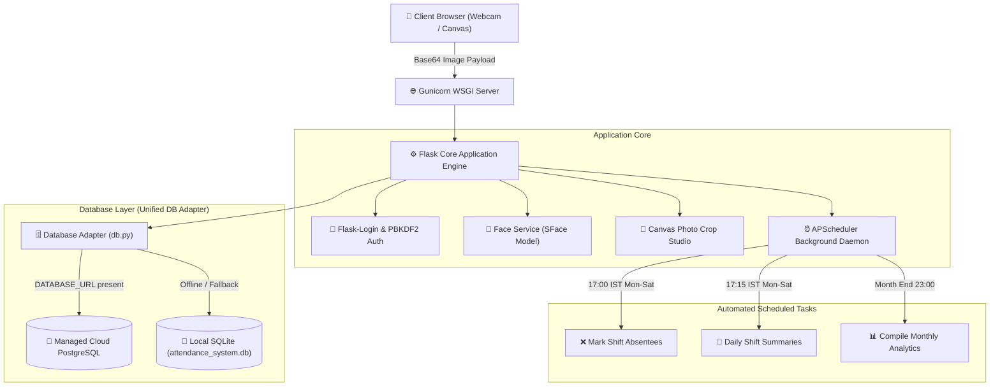

# 🎯 FaceAttend &mdash; Enterprise Neural Face Recognition Attendance System

<div align="center">

[](https://www.python.org/)
[](https://flask.palletsprojects.com/)
[](https://www.postgresql.org/)
[](https://github.com/serengil/deepface)
[](https://www.sqlite.org/)
[](https://render.com)
[](LICENSE)

**An enterprise-grade, browser-based biometric attendance ecosystem powered by lightweight neural face recognition (SFace), automated corporate shift logic, and cloud PostgreSQL persistence.**

[🚀 Live Demo](https://face-attendance-deepface.onrender.com) &bull; [📖 Architecture](#️-system-architecture) &bull; [🏢 Shift Logic](#-corporate-attendance--shift-engine) &bull; [📡 API Docs](#-api-reference-22-endpoints) &bull; [⚡ Quickstart](#-getting-started-local)

</div>

---

## 📋 Table of Contents

1. [🌟 Key Highlights & Features](#-key-highlights--features)
2. [🏢 Corporate Attendance & Shift Engine (6-Day Week)](#-corporate-attendance--shift-engine)
3. [🏗️ System Architecture](#️-system-architecture)
4. [🤖 Neural Face Recognition Pipeline](#-neural-face-recognition-pipeline)
5. [🎨 Interactive Profile Photo Studio](#-interactive-profile-photo-studio)
6. [📊 Real-Time Live Employee Dashboard](#-real-time-live-employee-dashboard)
7. [Admin Attendance Logs & Operations](#admin-attendance-logs--operations)
8. [🗄️ Cloud PostgreSQL & Dual-Engine Database](#️-cloud-postgresql--dual-engine-database)
9. [⏰ Background Automation & Scheduler](#-background-automation--scheduler)
10. [🔐 Authentication & Role Management](#-authentication--role-management)
11. [📡 API Reference (24 Endpoints)](#-api-reference-24-endpoints)
12. [📁 Project Directory Tree](#-project-directory-tree)
13. [⚡ Getting Started (Local Development)](#-getting-started-local-development)
14. [☁️ Production Deployment (Render)](#️-production-deployment-render)
15. [⚙️ Environment Variables Reference](#️-environment-variables-reference)
16. [🛡️ Security & Anti-Spoofing Architecture](#️-security--anti-spoofing-architecture)
17. [📄 License](#-license)

---

## 🌟 Key Highlights & Features

* **Lightweight Neural Biometrics (SFace):** Ultra-fast **28MB** deep neural network (compared to VGG-Face at 580MB), optimized for real-time CPU face recognition on cloud servers (Render free tier / 512MB RAM).
* **6-Day Corporate Work Week (Mon–Sat):** Complete 9-to-5 automated corporate lifecycle with on-time grace periods, late-entry logging, half-day detection, Sunday weekly off enforcement, and automated shift-end device locking.
* **Real-Time Live Dashboard:** Live working hours ticker that auto-freezes at 5:00 PM shift end, visual 6-day week strip (Mon–Sat), dynamic shift timeline bar, streak counter (skips Sundays), and automatic client refresh.
* **Interactive Circular Photo Cropper Studio:** In-browser canvas editor with drag-and-pan positioning, zoom slider / mouse wheel scaling, 90° rotation, and real-time avatar sync across Dashboard, Top Navbar, and Sidebar.
* **Dual-Engine Smart Database Adapter:** Automatically uses **Cloud PostgreSQL** in production when `DATABASE_URL` is set, and falls back seamlessly to **Local SQLite** for offline development.
* **Automated Cron Jobs (`APScheduler`):**
  * Auto-marks absentees at 5:00 PM IST (Mon–Sat).
  * Auto-generates daily summary logs at 5:15 PM IST.
  * Auto-compiles monthly reports at the end of each month.
* **Dedicated Admin Control Panel:** Separate secure admin login, a single consolidated Attendance Logs dashboard, full user directory management, real-time current-day employee status, and paginated individual history.

---

## 🏢 Corporate Attendance & Shift Engine

FaceAttend implements a strict, automated **6-Day Work Week (Monday to Saturday, 09:00 AM – 05:00 PM IST)**:

```
┌────────────────────────────────────────────────────────────────────────────────────────┐
│                        CORPORATE DAILY ATTENDANCE TIMELINE                             │
├───────────────────┬──────────────┬─────────────────────────────────────────────────────┤
│ Time Window (IST) │ Status       │ System Action                                       │
├───────────────────┼──────────────┼─────────────────────────────────────────────────────┤
│ 00:00 – 06:00 AM  │ ❌ REJECTED  │ Device locked — Office not open yet                 │
│ 06:00 – 09:15 AM  │ 🟢 PRESENT   │ Full day logged (On-Time with 15-min grace period)  │
│ 09:16 – 01:00 PM  │ 🟡 LATE      │ Late arrival recorded (Full day shift remaining)    │
│ 01:01 – 05:00 PM  │ 🔵 HALF DAY  │ Partial shift logged (After half-day cutoff)        │
│ 05:00 PM Sharp    │ 🔴 ABSENT    │ APScheduler auto-marks all unrecorded employees     │
│ After 05:00 PM    │ ❌ REJECTED  │ Device locked — Rejects after-hours scan attempts   │
│ Sunday (All Day)  │ ⛔ CLOSED    │ Weekly Off — Scanner rejects check-ins, skips streak │
└───────────────────┴──────────────┴─────────────────────────────────────────────────────┘
```

### Attendance Metrics & Calculation Rules:
* **Working Days Denominator:** Evaluates all **Monday to Saturday** calendar days in the month up to today (Sundays are strictly excluded).
* **Attendance Rate (%):**
  $$\text{Rate} = \frac{\text{Present} + \text{Late} + (0.5 \times \text{Half Day})}{\text{Mon–Sat Working Days}} \times 100$$
* **Current Streak:** Tracks consecutive attended workdays (Mon–Sat). Sundays are seamlessly bypassed without breaking or requiring attendance.

---

## 🏗️ System Architecture



---

## 🤖 Neural Face Recognition Pipeline

Face detection and embedding extraction use **SFace** (Spherical Feature Face Recognition), an ultra-efficient deep convolutional neural network:

```
[ Webcam Frame ] ──> [ OpenCV Haar Cascade ] ──> [ 112x112 Normalization ] ──> [ SFace ConvNet ] ──> [ 128-D Embedding ]
                                                                                                            │
                                                                                                            ▼
[ Attendance Verified ] <── [ L2 Euclidean Distance < 12.0 ] <── [ Vector Match vs Stored Users ] <────────┘
```

### Inference Specifications:
* **Vector Output:** 128-dimensional floating point array.
* **Threshold:** L2 distance `< 12.0` (configurable via `FACE_RECOGNITION_THRESHOLD`).
* **Model Size:** **28MB** (preloaded in a background daemon thread on boot to prevent cold start latency).
* **Speed:** ~150ms – 300ms inference time on standard 1-vCPU cloud instances.

---

## 🎨 Interactive Profile Photo Studio

FaceAttend includes a full-featured, zero-dependency client-side photo editor on **My Profile (`/auth/profile`)**:

1. **Dual Capture Modes:** Upload any image file (`JPG`, `PNG`, `WEBP`) or capture directly using your device camera.
2. **Free Drag & Pan:** Click & drag or touch-move to reposition the face inside the circular crop guide.
3. **Zoom Controls:** Range slider ($0.5\times$ to $3.0\times$) + mouse scroll wheel zooming.
4. **90° Rotation & Reset:** Correct orientation and re-center instantly.
5. **Exact Circle Export:** Exports the exact framed circle as an optimized $512 \times 512$ Base64 Data URI directly into PostgreSQL/SQLite.
6. **Real-Time Site-Wide Sync:** Updates instantly across **Dashboard Greeting**, **Top Navbar Menu**, and **Sidebar Footer**.

---

## 📊 Real-Time Live Employee Dashboard

* **Welcome Header:** Shows profile photo, employee name, live date, and dynamic office status chip (`Office Open`, `Opens 6:00 AM`, `Closed`, `Closed Sunday`).
* **Today Banner:** Live color-coded status card (Green `Present`, Yellow `Late`, Blue `Half Day`, Red `Absent`, Grey `Office Closed`).
* **Shift Timeline Bar:** Real-time visual progress percentage across the 9-to-5 workday with an interactive check-in pin marker.
* **Working Hours Counter:** Live `HH:MM:SS` ticker that automatically freezes at 5:00 PM shift end and displays *"Shift ended — final hours"*.
* **6-Day Week Strip:** Displays attendance status dots for **Mon, Tue, Wed, Thu, Fri, Sat**.
* **Streak Counter:** Calculates consecutive attended days with Sunday bypass.

---

## Admin Attendance Logs & Operations

The administrator portal now uses one consolidated dashboard at `/admin`. The former duplicate All Attendance screen has been removed from the navigation and the legacy `/admin/attendance` URL safely redirects to the main dashboard.

### Current-Day Command View

The Attendance Logs dashboard is designed as a live employee roster rather than a partial attendance table:

* Shows every active non-admin user for the current IST working date.
* Uses a database `LEFT JOIN` from `users` to `attendance`, so users without an attendance row are still visible.
* Displays Present, Late, Half Day, Pending, and Absent states with clear visual badges.
* Treats a missing check-in as Pending before 5:00 PM and Absent after shift close, preventing false absences during the workday.
* Displays summary counts for employees, present, late, half-day, absent, and pending users.
* Supports employee search, status filtering, and biometric enrollment filtering.
* Synchronizes through one responsive live-sync control with manual refresh and automatic 30-second polling.

### Individual History

Administrators can open View history for any employee and inspect:

* Complete working-day history, including implicit absent days where no row was stored.
* Date-range and status filters.
* Paginated records for memory-efficient rendering.
* Present, Late, Half Day, Absent, and Pending summary totals.
* Check-in time, attendance source, notes, and record metadata.

### Admin Navigation

The admin experience contains two focused destinations:

* **Attendance Logs** — live current-day monitoring and individual history.
* **User Management** — account lifecycle, biometric enrollment status, and protected user deletion.

Responsive shortcuts are available between both destinations, while the sidebar remains the canonical navigation surface.

---

## 🗄️ Cloud PostgreSQL & Dual-Engine Database

The database adapter (`app/models/db.py`) automatically auto-detects its environment:

```python
# Automatic Engine Selection
DATABASE_URL = os.getenv('DATABASE_URL')
if DATABASE_URL:
    # Production: Cloud PostgreSQL (Render)
    conn = psycopg2.connect(DATABASE_URL)
else:
    # Development: Local SQLite fallback
    conn = sqlite3.connect('attendance_system.db')
```

### Key Database Tables:
* `users` &mdash; Account credentials, role (`user`/`admin`), PBKDF2 hash, SFace `embedding`, and `profile_picture`.
* `attendance` &mdash; Daily attendance rows (`date`, `time_in`, `time_out`, `status`, `marked_by`).
* **Admin roster resolution** &mdash; Current-day status is calculated from the complete active-user roster, so absent and pending employees remain visible even when no attendance row exists.
* **History indexes** &mdash; Composite `(date, user_id)` and `(user_id, date)` indexes support fast current-day joins and individual history queries.
* `working_hours` &mdash; Shift configuration per day of week (Mon–Sat active, Sun off).
* `attendance_reports` &mdash; Generated daily, weekly, and monthly aggregate analytics.
* `audit_logs` &mdash; Security audit trail for profile updates, logins, and overrides.

---

## ⏰ Background Automation & Scheduler

Powered by **APScheduler**, scheduled in the **Asia/Kolkata (IST)** timezone:

The admin dashboard does not depend on a successful scheduler run to display a missing employee. It calculates current-day Pending/Absent status from the active-user roster and reconstructs missing historical working days as absent. The scheduler remains responsible for persisting end-of-day absent rows, audit events, summaries, and monthly maintenance.

```python
# scheduler.py
scheduler.add_job(
    AttendanceScheduler.mark_end_of_day_absentees,
    CronTrigger(hour=17, minute=0, day_of_week='0-5'), # Mon-Sat 5:00 PM IST
    id='mark_absentees'
)
scheduler.add_job(
    AttendanceScheduler.send_daily_summaries,
    CronTrigger(hour=17, minute=15, day_of_week='0-5'), # Mon-Sat 5:15 PM IST
    id='send_summaries'
)
scheduler.add_job(
    AttendanceScheduler.generate_monthly_reports,
    CronTrigger(day=1, hour=23, minute=0), # Monthly summary
    id='monthly_reports'
)
```

---

## 🔐 Authentication & Role Management

* **PBKDF2 Password Hashing:** 100,000 SHA-256 iterations with per-user cryptographic salts.
* **Persistent Sessions ("Remember Me for 30 Days"):** Tamper-proof, `HttpOnly`, `Secure` signed session cookies.
* **Role-Based Access Control (RBAC):**
  * `User` &mdash; Personal dashboard, webcam scanner, attendance history, profile photo studio.
  * `Admin` &mdash; System management, user directory, global attendance logs, absentee overrides.
* **Dedicated Portals:** Separate `/auth/login` (with user registration) and `/auth/admin-login` (clean admin gateway).

---

## 📡 API Reference (24 Endpoints)

### 🌐 JSON REST APIs
| Method | Endpoint | Description |
|---|---|---|
| `POST` | `/api/recognize-face` | Biometric face recognition engine & attendance punch-in |
| `POST` | `/api/register-user` | Face enrollment & SFace 128-D embedding extraction |
| `GET` | `/api/attendance` | Real-time user attendance logs & canonical status resolution |
| `GET` | `/api/users` | List all registered users with biometric status |
| `GET` | `/api/admin/attendance/today` | Admin-only live current-day roster for every active non-admin user |
| `GET` | `/api/admin/attendance/history/<user_id>` | Admin-only paginated user history with implicit absent working days |
| `POST` | `/auth/update-profile-picture` | Save real-time cropped profile photo / webcam snapshot |
| `POST` | `/auth/remove-profile-picture` | Delete user profile picture |

### 🔐 Auth & Session Endpoints
| Method | Endpoint | Description |
|---|---|---|
| `GET`, `POST` | `/auth/login` | Employee login portal & session creation |
| `GET`, `POST` | `/auth/admin-login` | Dedicated Administrator control login portal |
| `GET`, `POST` | `/auth/register` | Employee account self-registration |
| `GET`, `POST` | `/auth/change-password` | Secure password update with hash verification |
| `GET` | `/auth/logout` | Secure session termination |

### 🖥️ Frontend Web Views
| Method | Endpoint | Description |
|---|---|---|
| `GET` | `/` | Root entry point (forces fresh session $\rightarrow$ login) |
| `GET` | `/dashboard` | Live employee dashboard (timeline, live counter, 6-day week strip) |
| `GET` | `/camera` | Real-time biometric camera attendance kiosk |
| `GET` | `/report` | Attendance analytics, date filters, and working hours table |
| `GET` | `/auth/profile` | My Profile page with interactive circular photo cropper studio |
| `GET` | `/register` | Biometric face capture onboarding view |
| `GET` | `/admin` | Consolidated Attendance Logs dashboard with live current-day employee status |
| `GET` | `/admin/users` | Admin user directory & account management |
| `GET` | `/admin/attendance` | Legacy compatibility URL; redirects to `/admin` |
| `GET` | `/health` | Cloud deployment health check probe (Render / Docker) |
| `GET` | `/static/<path:filename>` | Static asset engine (CSS, JS, 3D Logo) |

---

## 📁 Project Directory Tree

```
face-attendance-deepface/
├── app/
│   ├── __init__.py               # Flask app factory, LoginManager, DB init, scheduler
│   ├── models/
│   │   └── db.py                 # Dual-engine DB adapter, 9-to-5 corporate shift rules
│   ├── routes/
│   │   ├── api.py                # REST APIs (/api/recognize-face, /api/attendance)
│   │   ├── auth.py               # Flask-Login routes, profile picture endpoints
│   │   └── views.py              # HTML template rendering routes & admin views
│   ├── services/
│   │   ├── face_service.py       # OpenCV Haar Cascade & SFace 128-D embedding engine
│   │   └── scheduler.py          # APScheduler cron jobs (5 PM auto-absent, summaries)
│   ├── static/
│   │   ├── css/
│   │   │   └── style.css         # Design tokens, responsive shell layout
│   │   ├── img/
│   │   │   ├── logo.png          # 3D Camera App Icon (Favicon & Brand Logo)
│   │   │   └── logo.jpg          # High-resolution JPEG logo asset
│   │   └── js/
│   └── templates/
│       ├── 404.html              # Custom 404 Not Found error page
│       ├── 500.html              # Custom 500 Server Error page
│       ├── base.html             # App shell with favicon, navbar & sidebar includes
│       ├── camera.html           # Live attendance camera scanner kiosk
│       ├── index.html            # Live employee dashboard (Timeline, 5 PM counter, Week strip)
│       ├── login.html            # Secondary login view
│       ├── navbar.html           # Top navbar with real-time profile picture dropdown
│       ├── register.html         # Face enrollment webcam capture view
│       ├── report.html           # Historical attendance analytics with Mon-Sat metrics
│       ├── sidebar.html          # Sidebar navigation with 3D logo and user avatar
 │       ├── admin/
 │       │   ├── dashboard.html    # Consolidated Admin Attendance Logs dashboard
│       │   └── users.html        # Admin user directory management
│       └── auth/
│           ├── change_password.html # Secure password change portal
│           ├── login.html        # Primary login portal (User & Admin switcher)
│           ├── profile.html      # My Profile + Interactive Canvas Photo Cropper Studio
│           └── register.html     # Split-screen modern account registration
├── .env.example                  # Environment configuration template
├── .gitignore                    # Git ignore rules
├── Procfile                      # Gunicorn production startup command
├── README.md                     # Project documentation
├── render.yaml                   # Render Blueprint Infrastructure-as-Code
└── requirements.txt              # Production Python dependencies
```

---

## ⚡ Getting Started (Local Development)

### 1. Clone the Repository
```bash
git clone https://github.com/SuprabhSharma/face-attendance-deepface.git
cd face-attendance-deepface
```

### 2. Create and Activate Virtual Environment
```bash
# Windows
python -m venv venv
venv\Scripts\activate

# macOS / Linux
python3 -m venv venv
source venv/bin/activate
```

### 3. Install Dependencies
```bash
pip install -r requirements.txt
```

### 4. Configure Environment Variables
Copy `.env.example` to `.env`:
```bash
cp .env.example .env
```
*(Leave `DATABASE_URL` empty to automatically use local SQLite).*

### 5. Run the Application
```bash
python run.py
```
Open [http://localhost:5000](http://localhost:5000) in your browser.

---

## ☁️ Production Deployment (Render)

The project includes `render.yaml` for 1-click cloud deployment of the web service. PostgreSQL is configured through the `DATABASE_URL` environment variable:

1. Push your repository to GitHub.
2. In [Render Dashboard](https://dashboard.render.com), click **New +** &rarr; **Blueprint**.
3. Connect your repository. Render will automatically provision:
   * **Web Service:** Python 3.10 environment with Gunicorn WSGI.
4. Configure `DATABASE_URL` with your managed PostgreSQL provider (for example Neon or Supabase) and redeploy. The application automatically selects PostgreSQL when this variable is present and uses SQLite only for local development.
5. Deploy completes with automated SSL (HTTPS).

> The current `render.yaml` defines the web service only. Do not rely on Render Free PostgreSQL for permanent attendance data: Render Free databases expire after 30 days. Use a persistent external PostgreSQL free tier for a zero-cost pilot, and maintain encrypted backups.

---

## ⚙️ Environment Variables Reference

| Variable | Default | Description |
|---|---|---|
| `FLASK_ENV` | `development` | App environment (`development` or `production`) |
| `SECRET_KEY` | `dev-secret-...` | Cryptographic secret for signing session cookies |
| `DATABASE_URL` | *None* | PostgreSQL connection string (uses SQLite if unset) |
| `SCHEDULER_ENABLED` | `true` | Enables APScheduler background automation |
| `FACE_RECOGNITION_THRESHOLD` | `12.0` | SFace L2 distance threshold for face match |
| `ADMIN_USERNAME` | `admin` | Default administrator account username |
| `ADMIN_EMAIL` | `admin@faceattend.com` | Default administrator email |
| `ADMIN_PASSWORD` | `Admin@123` | Default administrator password |

---

## 🛡️ Security & Privacy Architecture

1. **Biometric Privacy:** Raw camera frames are processed in memory and **never stored to disk**. Only mathematical 128-D vector embeddings are stored.
2. **Tamper-Proof Timestamps:** Server-enforced Asia/Kolkata (IST) timestamps prevent client clock manipulation.
3. **Strict After-Hours Locking:** Biometric scans after 5:00 PM are rejected at the database level to prevent retroactive attendance tampering.
4. **Credential Security:** All passwords hashed using PBKDF2-HMAC-SHA256 with unique 32-byte salts.
5. **CSRF & XSS Hardening:** `HttpOnly`, `SameSite=Lax`, and `Secure` cookie policies across all session cookies.

---

## 📄 License

This project is licensed under the MIT License &mdash; see the [LICENSE](LICENSE) file for details.

---

<div align="center">
  <p>&copy; 2026 Face Recognition Attendance System. All rights reserved.</p>
</div>
